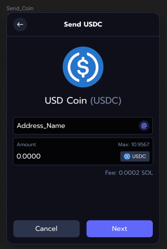
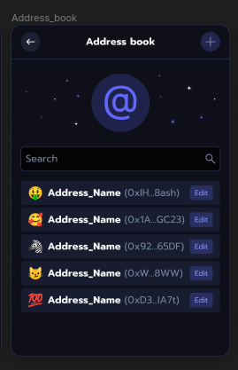
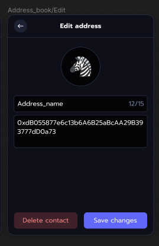
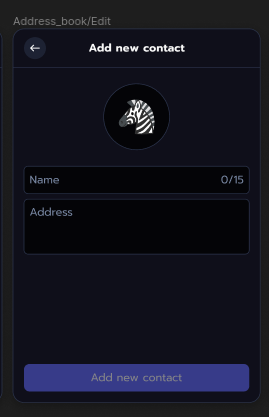

# Nightly Wallet test cases

***

# &bull; Screen no. 1

| ID | TEST DESCRIPTION    | TEST STEPS                              | TEST DATA     | EXCPETED RESULT          |
|----|---------------------|-----------------------------------------|---------------|--------------------------|
| 1  | Search test         | Search for existing app                 | "uniswap.org"   | Shows uniswap.org        |
| 2  | Search uppercase    | Search for existing app using uppercase |  "UNISWAP"      | Shows uniswap.org        |
| 3  | Remove button       | Remove app                              | "binance.com"   | App is removed from list |
| 4  | Search after remove | Remove app, then search for it          | "mango.markets" | Shows no results         |
| 5  | Search for domain extension | Search for existing app domain extension | "exchange"      | Shows dydx.exchange       |

***

# &bull; Screen no. 2

| ID | TEST DESCRIPTION         | TEST STEPS                                        | TEST DATA                                                     | EXCPETED RESULT                              |
|----|--------------------------|---------------------------------------------------|---------------------------------------------------------------|----------------------------------------------|
| 1  | Address symbol input     | Try to insert symbol in address field             | "./"                                                            | Can`t insert symbol, wrong input warning     |
| 2  | Address whitespace input | Try to insert whitespace in address field         | Whitespace                                                    | Can`t insert whitespace, wrong input warning |
| 3  | Address too short input  | Insert address shorter than 27 characters         | Less than 27 characters                                       | Adrress too short warning                    |
| 4  | Address too long input   | Try to insert address longer than 27 characters   | More than 27 characters                                       | Only 27 characters are inserted into field   |
| 5  | Valid input              | Insert valid address and valid amount, press next | 27 characters, only numbers and letters amount lower than max | Proceeds to next step                        |
| 6  | Amount symbol input      | Try to insert symbol in amount field              | "./"                                                            | Can`t insert symbol, wrong input warning     |
| 7  | Amount whitespace input  | Try to insert whitespace in amount field          | Whitespace                                                    | Can`t insert whitespace, wrong input warning |
| 8  | Amount letter input      | Try to insert letter in amount field              | Letter                                                        | Can`t insert letter, wrong input warning     |
| 9  | Amount too high          | Insert amount higher than max                     | "11.123"                                                        | Amount too high warning                      |

***

# &bull; Screen no. 3

| ID | TEST DESCRIPTION  | TEST STEPS                | TEST DATA     | EXCPETED RESULT          |
|----|-------------------|---------------------------|---------------|--------------------------|
| 1  | Search by name    | Search using address name | "Address_Name"  | Shows matching entries |
| 2  | Search by address | Search using address      | Valid address | Shows matching entries |
| 3  | Edit button       | Click edit button         | none          | Opens edit view          |
| 4  | Add button        | Click add button          | none          | Opens add view           |

***

# &bull; Screen no. 4

| ID | TEST DESCRIPTION           | TEST STEPS                                      | TEST DATA                       | EXCPETED RESULT                              |
|----|----------------------------|-------------------------------------------------|---------------------------------|----------------------------------------------|
| 1  | Delete button              | Click delete button                             | none                            | Address entry is removed from Address Book   |
| 2  | Save button                | Change address data, click save button          | Valid address data              | Address entry is updated in Address Book     |
| 3  | Address symbol input       | Try to insert symbol in address field           | "./"                            | Can`t insert symbol, wrong input warning     |
| 4  | Address whitespace input   | Try to insert whitespace in address field       | Whitespace                      | Can`t insert whitespace, wrong input warning |
| 5  | Address too short input    | Insert address shorter than 27 characters       | Less than 27 characters         | Adrress too short warning                    |
| 6  | Address too long input     | Try to insert address longer than 27 characters | More than 27 characters         | Only 27 characters are inserted into field   |
| 7  | Address present in Book    | Insert address present in Address Book          | Address present in Address Book | Address is present in Address Book error     |
| 8  | Name too long input        | Try to insert name longer than 15 characters    | More than 15 characters         | Only 15 characters are inserted into field   |

***

# &bull; Screen no. 5

| ID | TEST DESCRIPTION           | TEST STEPS                                      | TEST DATA               | EXCPETED RESULT                              |
|----|----------------------------|-------------------------------------------------|-------------------------|----------------------------------------------|
| 1  | Address symbol input       | Try to insert symbol in address field           | "./"                    | Can`t insert symbol, wrong input warning     |
| 2  | Address whitespace input   | Try to insert whitespace in address field       | Whitespace              | Can`t insert whitespace, wrong input warning |
| 3  | Address too short input    | Insert address shorter than 27 characters       | Less than 27 characters | Adrress too short warning                    |
| 4  | Address too long input     | Try to insert address longer than 27 characters | More than 27 characters | Only 27 characters are inserted into field   |
| 5  | Name too long input        | Try to insert name longer than 15 characters    | More than 15 characters | Only 15 characters are inserted into field   |
| 6  | Valid input                | Input valid address and name, click add         | Valid address and name  | Address is added to Address Book             |

***